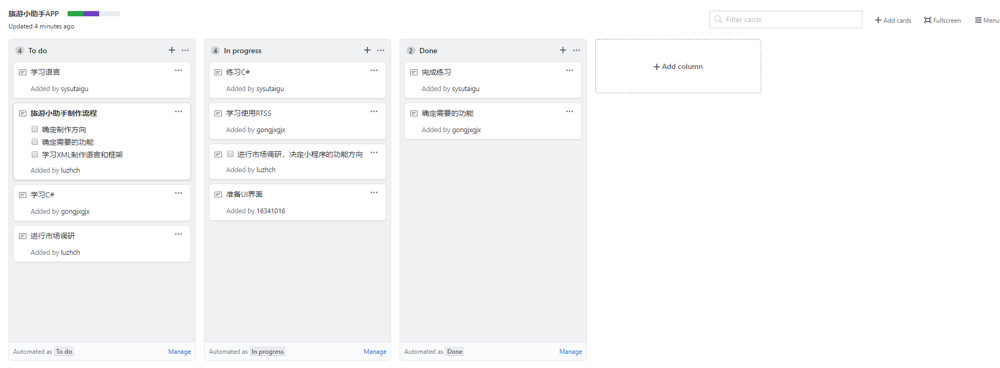

# 用简短的语言给出对分析、设计的理解
需求分析解决的是“做什么”的问题， 系统设计解决的是“怎么做”的问题。

需求分析所要做的工作是深入描述软件的功能和性能，确定软件设计的限制和软件同其他系统元素的接口细节，定义软件的其他有效性需求，细化软件要处理的数据域。用一句话概括就是：需求分析主要是确定待开发软件的功能、性能、数据、界面等要求。

软件设计是一个把软件需求变换成软件表示的过程。最初这种表示只是描绘出软件的总体框架，然后再进一步细化，并在此框架中填入细节。
# 用一句话描述面向对象的分析与设计的优势
面向对象方法以客观世界中的对象为中心，其分析和设计思想符合人们的思维方式，分析和设计的结构与客观世界的实际比较接近，容易被人们接受。
# 简述 UML（统一建模语言）的作用。考试考哪些图
UML是一种开放的建模语言，用于说明、可视化、构建和编写一个正在开发的、面向对象的、软件密集系统的制品的开放方法。

考试要考的图有：用例图、静态图（类图、对象图、包图）、行为图（交互图、状态图、活动图）、实现图（构件图、部署图）。
# 从软件本质的角度，解释软件范围（需求）控制的可行性
软件的四个本质特征：

complexity 复杂性

conformity 一致性

changeability 可变性

invisibility 不可视性

项目的首要约束是工期、范围、质量和预算四个而基本元素（项目管理三角模型）。一个项目合约，即是关于四个元素在理论上的精确的约定。项目管理的任务就是优化调度资源使得这些约束得以满足，且最低的成本。

在实际软件项目中，即使在有明确的软件开发合同条件下，这四个约束并不是不可商量的。原因在于软件生产是易变、不可见、独特的智力生产！因为我们并不能如生产肥皂、衣服一样先给一个样品参考标准，甚至在项目开发完成也无法写出完善的软件需求规格说明书。

从提升客户满意度的角度，了解并控制这四个元素就是 软件项目成功的关键。
# 项目管理实践
看板使用练习（提交看板执行结果贴图，建议使用 Git project）

    使用截图工具（png格式输出），展现你团队的任务 Kanban

    每个人的任务是明确的。必须一周后可以看到具体结果

    每个人的任务是1-2项

    至少包含一个团队活动任务
  
