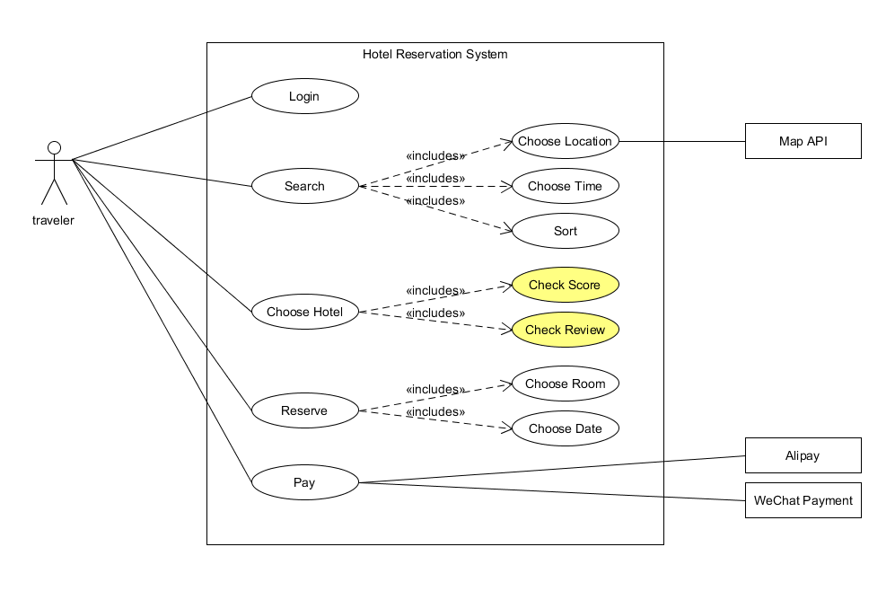

# 1、 简答题

* 用例的概念

Ans:用例是软件工程或系统工程中对系统如何反应外界请求的描述，是一种通过用户的使用场景来获取需求的技术。

* 用例和场景的关系？什么是主场景或 happy path？

Ans:每个用例提供了一个或多个场景，该场景说明了系统是如何和最终用户或其它系统互动，也就是谁可以用系统做什么，从而获得一个明确的业务目标。
主成功场景是用例最基本的组成部分,它描述了满足涉众关注点的典型成功路径。

* 用例有哪些形式？

Ans:在不同的团队情况也可能导致用例书写的不一样。比如在一个大型的开发项目组里，就需要严格的按照用例范例进行描述，而在一个小型的沟通频繁的项目组里，则可以采用一种比较简单的描述方式。
用例的格式有：完整正式的格式、非正式、单列表格式、双列表格式、RUP格式、条件语句格式、Occam格式、图形方式、UML用例图

* 对于复杂业务，为什么编制完整用例非常难？

Ans:复杂的业务本身业务流程就很复杂繁琐，而且涉及到的场景非常多，很难将所有的目标、故事、使用场景遵循一定的顺序列举出来。如果场景不够全面，那么用例的完整性就难以保障。

* 什么是用例图？

Ans:用例图是指由参与者（Actor）、用例（Use Case），边界以及它们之间的关系构成的用于描述系统功能的视图，也是外部用户所能观察到的系统功能的模型图。* 用例图的基本符号与元素？

Ans:

小人：参与者

椭圆：用例

方框：系统，可以是小型软件组件，也可以是完整的应用程序，里面包含外部可见的功能。

箭头：参与者和系统通过相互发送信号或消息进行交互的关联关系，包括关联、泛化、包含、扩展。

连线 ：表示参与者与用例之间的交互

* 用例图的画法与步骤

Ans:
用例图画法与步骤如下：

1) 系统框放在中间，系统名写在上方正中间。

2) 确定参与者，包括:

主要参与者：使用系统的主要功能、需要系统的支持以完成工作

协作参与者：将提供对应的系统功能、谁将维护系统，保证系统处于工作状态

幕后参与者：对系统产生的结果感兴趣

3) 确定参与者之间的关系（是否为泛化关系）

4) 根据需求识别和创作用例

5) 确认用例间的关系，包括包含和扩展

6) 确认用例与参与者之间的关系，包括包含

7) 在用例的事件流中逐渐发现其他的支持系统，放置在系统框的右边

* 用例图给利益相关人与开发者的价值有哪些？

Ans:
对于利益相关人来说：

可以直观看到系统的结果和用户的功能体验，保证系统按照用户的需求进行设计。

用例能够根据需要对复杂程度和形式化程序进行增减调节，即能够响应用户（利益相关人)提出的需求，而用例图则使得这种调节更加便利，可以通过修改图形间的关系实现。

对于开发者来说：

用例图是设计者设计过程的结论与参考，设计者与开发者之间的交流工具，开发者开发过程的蓝图。

用例图使得开发者能够更明确地获得需求，更好地理解需求。

用例图可以指导开发和测试，同时可以在整个过程中对其他工作流起到指导作用。

# 2、建模练习题（用例模型）

## 选择2-3个你熟悉的类似业务的在线服务系统（或移动 APP），如定旅馆（携程、去哪儿等）、定电影票、背单词APP等，分别绘制它们用例图。并满足以下要求：
* 请使用用户的视角，描述用户目标或系统提供的服务
* 粒度达到子用例级别，并用 include 和 exclude 关联它们
* 请用色彩标注出你认为创新（区别于竞争对手的）用例或子用例
* 尽可能识别外部系统和服务
* 然后，回答下列问题：

选择携程和淘票票

`携程`：

`淘票票`：

1.为什么相似系统的用例图是相似的？

Ans:因为相似的系统业务目标是相似的，对应的用例场景相似，所以用例图也是相似的

2.如果是定旅馆业务，请对比 Asg_RH 用例图，简述如何利用不同时代、不同地区产品的用例图，展现、突出创新业务和技术

Ans:
* 与 Asg_RH 用例图 相比，携程添加了地图API，更易于使用

* 支持打分评论系统，有利于选择服务质量更好的酒店

* 支持支付宝和微信等移动支付方式

3.如何利用用例图定位创新思路（业务创新、或技术创新、或商业模式创新）在系统中的作用

Ans：
* 若创新用例与参与者直接关联，则作用明显
* 若创新点位包含关系的子用例，则作用较大
* 若创新点为扩展关系的子用例，则作用有限
4.请使用 SCRUM 方法，选择一个用例图，编制某定旅馆开发的需求（backlog）开发计划表
Ans：

5.根据任务4，参考 使用用例点估算软件成本，给出项目用例点的估算
